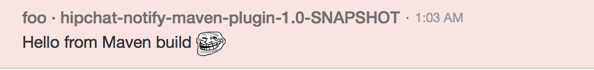

### Maven HipChat notification plugin

This project is a small Maven plugin which can send notifications from a Maven build
to a HipChat room.

#### Installation and setup

Install the plugin in your local repo:

    mvn clean install
    
In the sidebar in your Hipchat room, click the "..." at the top right.
In the popup menu select "Integrations", then in the popup window select "+Install new integrations".
This will open a browser window (you may have to login) where you can make a selection;
select "Build your own integration" here.

Choose a name for your integration (in the chat screenshot you can see that I chose "foo").
In the next window there will be a field labeled "Send messages to this room by posting to this URL".
Note the "room" and "auth_token" fields, you will need these to configure the plugin.
See the screenshot.

The other two fields to configure are the message you want to send, and a label 
that will be added to the sender's name. The sender's name will be the name you chose
for your integration in the previous step.

#### Usage

The plugin has the following parameters, which can all be set in the `<configuration>` section
of the plugin, or in the Maven commandline:

| XML | Commandline | Purpose
|-----|-------------|----------
`message` | `notification.message` | text to send
`from` | `notification.from` | sender label
`room` | `notification.room` | room indentifier
`authToken` | `notification.authToken` | authentication token

The plugin is executed by specifying the full group- and artifactId and the goal.
The only supported goal is `notify`.

For example, if the plugin is configured like this

            <plugin>
                <groupId>org.vanbart</groupId>
                <artifactId>hipchat-notify-maven-plugin</artifactId>
                <version>1.0-SNAPSHOT</version>
                <configuration>
                    <message>Hello from Maven build (troll)</message>
                    <from>${project.build.finalName}</from>
                </configuration>
            </plugin>

And Maven is executed like this:

    mvn org.vanbart:hipchat-notify-maven-plugin:notify -Dnotify.room=<your-room-here> -Dnotify.authToken=<your-token-here>
    
The result will look like this:

Note that you can include emoticons, and Maven variables are expanded.

#### License

This project is licensed under the [Apache License, Version 2.0](http://www.apache.org/licenses/LICENSE-2.0.html)